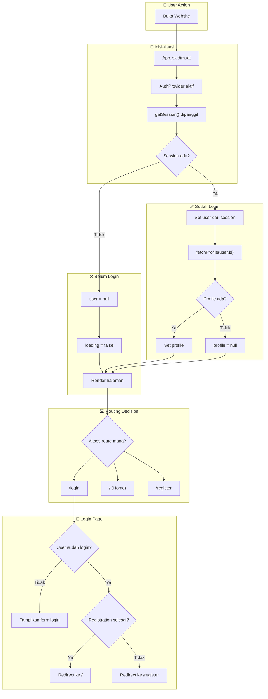
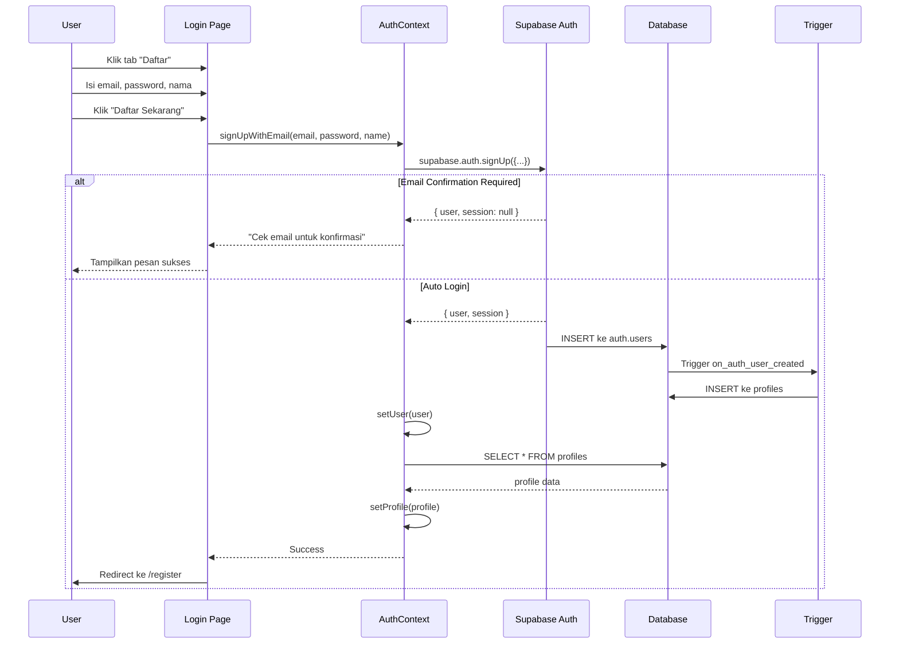
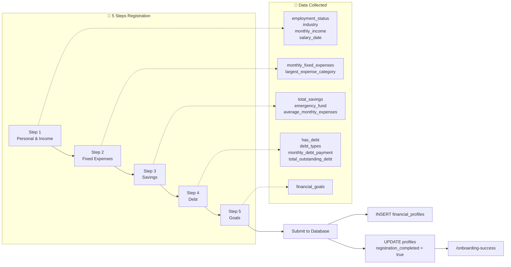
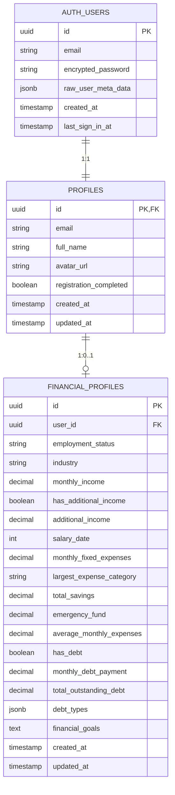
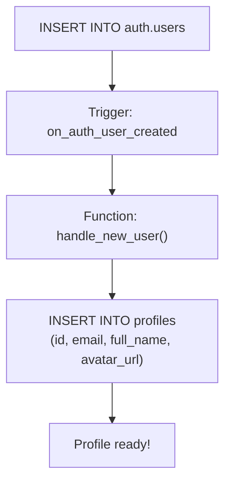
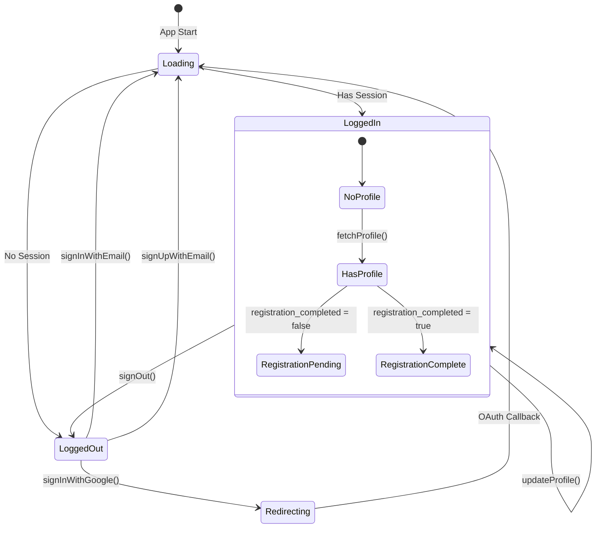

# 📚 Finance AI - Dokumentasi Lengkap

> Dokumentasi ini menjelaskan cara kerja website Finance AI dari awal sampai progress saat ini.

---

## 📋 Daftar Isi

1. [Overview Aplikasi](#overview-aplikasi)
2. [Tech Stack](#tech-stack)
3. [Struktur Folder](#struktur-folder)
4. [Flow Autentikasi](#flow-autentikasi)
5. [Flow Registrasi](#flow-registrasi)
6. [Database Schema](#database-schema)
7. [Komponen Utama](#komponen-utama)
8. [Debugging Guide](#debugging-guide)

---

## Overview Aplikasi

Finance AI adalah aplikasi web untuk mengelola keuangan pribadi dengan bantuan AI. Fitur utama:

| Fitur | Deskripsi | Status |
|-------|-----------|--------|
| Auth dengan Email/Password | User bisa daftar dan login dengan email | ✅ Done |
| Auth dengan Google | OAuth login via Google | ✅ Done |
| Multi-step Registration | Form 5 langkah untuk data keuangan | ✅ Done |
| Dashboard | Pantau kondisi keuangan | 🔜 Coming |
| AI Assistant | Tanya jawab keuangan | 🔜 Coming |
| Telegram Bot | Input via chat | 🔜 Coming |

---

## Tech Stack

```
┌─────────────────────────────────────────────────────────┐
│                      FRONTEND                            │
│  ┌─────────┐  ┌─────────────┐  ┌──────────────────────┐ │
│  │  React  │  │ React Router│  │ Vite (Build Tool)    │ │
│  └─────────┘  └─────────────┘  └──────────────────────┘ │
└─────────────────────────────────────────────────────────┘
                         │
                         ▼
┌─────────────────────────────────────────────────────────┐
│                     BACKEND (BaaS)                       │
│  ┌─────────────────────────────────────────────────────┐ │
│  │                    SUPABASE                          │ │
│  │  ┌───────────┐  ┌──────────────┐  ┌──────────────┐  │ │
│  │  │   Auth    │  │  PostgreSQL  │  │  Realtime    │  │ │
│  │  │  (OAuth)  │  │  (Database)  │  │  (Coming)    │  │ │
│  │  └───────────┘  └──────────────┘  └──────────────┘  │ │
│  └─────────────────────────────────────────────────────┘ │
└─────────────────────────────────────────────────────────┘
```

---

## Struktur Folder

```
src/
├── components/           # Komponen reusable
│   ├── Navbar.jsx       # Navigation bar
│   ├── Footer.jsx       # Footer
│   ├── ProtectedRoute.jsx # Route guard
│   └── LoadingSpinner.jsx # Loading indicator
│
├── contexts/            # React Context
│   └── AuthContext.jsx  # State management auth
│
├── lib/                 # Library/utilities
│   └── supabase.js      # Supabase client config
│
├── pages/               # Halaman-halaman
│   ├── Home/            # Landing page
│   ├── Login/           # Login & Signup
│   ├── Register/        # Multi-step form
│   │   ├── Register.jsx
│   │   ├── components/  # ProgressBar, StepNavigation
│   │   └── steps/       # 5 step forms
│   ├── AuthCallback/    # OAuth callback handler
│   └── OnboardingSuccess/ # Success page
│
├── App.jsx              # Main app + routing
├── main.jsx             # Entry point
└── index.css            # Global styles
```

---

## Flow Autentikasi

### Diagram Lengkap



### Penjelasan Step-by-Step

#### 1. **User Buka Website**
```
Browser → http://localhost:5173
```

#### 2. **React App Dimuat**
```javascript
// main.jsx
ReactDOM.createRoot(document.getElementById('root')).render(
  <StrictMode>
    <App />
  </StrictMode>
)
```

#### 3. **App.jsx Render**
```javascript
// App.jsx
function App() {
  return (
    <Router>
      <AuthProvider>  {/* ← AuthContext membungkus semua */}
        <AppContent />
      </AuthProvider>
    </Router>
  );
}
```

#### 4. **AuthProvider Inisialisasi**
```javascript
// AuthContext.jsx - useEffect saat mount
useEffect(() => {
  const initializeAuth = async () => {
    // 1. Cek session yang tersimpan
    const { data: { session } } = await supabase.auth.getSession();
    
    // 2. Jika ada session, set user
    if (session?.user) {
      setUser(session.user);
      fetchProfile(session.user.id);
    }
    
    // 3. Selesai loading
    setLoading(false);
  };
  
  initializeAuth();
}, []);
```

#### 5. **Routing Decision**
```javascript
// App.jsx - Routes
<Routes>
  <Route path="/login" element={<Login />} />
  <Route path="/auth/callback" element={<AuthCallback />} />
  <Route path="/register" element={
    <ProtectedRoute requireRegistration={false}>
      <Register />
    </ProtectedRoute>
  } />
  <Route path="/" element={
    <ProtectedRoute>
      <Home />
    </ProtectedRoute>
  } />
</Routes>
```

---

## Flow Registrasi

### Diagram Signup Email/Password



### Diagram Multi-Step Registration Form



---

## Database Schema

### Entity Relationship Diagram



### Penjelasan Tabel

#### 1. `auth.users` (Managed by Supabase)
> Tabel bawaan Supabase untuk authentication

| Column | Type | Description |
|--------|------|-------------|
| [id](file:///c:/Users/Ryan/Projects/AI-Enhanced%20Personal%20Finance%20Assistant/src/pages/Login/Login.jsx#68-99) | UUID | Primary key, auto-generated |
| `email` | TEXT | Email user |
| `encrypted_password` | TEXT | Password yang di-hash |
| `raw_user_meta_data` | JSONB | Data tambahan (full_name, dll) |

#### 2. `public.profiles`
> Extended user info, dibuat otomatis oleh trigger saat signup

| Column | Type | Description |
|--------|------|-------------|
| [id](file:///c:/Users/Ryan/Projects/AI-Enhanced%20Personal%20Finance%20Assistant/src/pages/Login/Login.jsx#68-99) | UUID | FK ke auth.users |
| `email` | TEXT | Duplikat untuk kemudahan query |
| `full_name` | TEXT | Nama lengkap user |
| `avatar_url` | TEXT | URL foto profil |
| `registration_completed` | BOOLEAN | Sudah isi form registrasi? |

#### 3. `public.financial_profiles`
> Data keuangan dari form registrasi 5 langkah

| Column | Type | Description |
|--------|------|-------------|
| `user_id` | UUID | FK ke profiles |
| `employment_status` | TEXT | full_time, freelance, dll |
| `monthly_income` | DECIMAL | Pendapatan bulanan |
| `has_debt` | BOOLEAN | Punya utang? |
| `debt_types` | JSONB | Array jenis utang |
| `financial_goals` | TEXT | Tujuan keuangan |

### Trigger Flow



---

## Komponen Utama

### AuthContext - State Management



### ProtectedRoute - Route Guard

```javascript
// Cara kerja ProtectedRoute
function ProtectedRoute({ children, requireRegistration = true }) {
  const { user, profile, loading, hasCompletedRegistration } = useAuth();

  // 1. Masih loading? Tampilkan spinner
  if (loading) return <LoadingSpinner />;

  // 2. Belum login? Redirect ke /login
  if (!user) return <Navigate to="/login" />;

  // 3. Butuh registrasi tapi belum selesai? Redirect ke /register
  if (requireRegistration && profile && !hasCompletedRegistration()) {
    return <Navigate to="/register" />;
  }

  // 4. Semua OK, render children
  return children;
}
```

---

## Debugging Guide

### Common Issues

#### 1. "Infinite recursion detected in policy"
**Penyebab**: RLS policy konflik dengan trigger

**Solusi**: Jalankan SQL dari [supabase-setup.sql](file:///c:/Users/Ryan/Projects/AI-Enhanced%20Personal%20Finance%20Assistant/supabase-setup.sql) yang sudah diperbaiki

#### 2. "Database error saving new user"
**Penyebab**: Trigger gagal insert ke profiles

**Solusi**: Pastikan tabel profiles ada dan trigger sudah benar

#### 3. Loading stuck / infinite loading
**Penyebab**: getSession() atau fetchProfile() hang

**Solusi**: Sudah ditambahkan timeout 5 detik di AuthContext

### Debug Checklist

```
□ Cek browser console untuk error
□ Cek Supabase Dashboard → Authentication → Users
□ Cek Supabase Dashboard → Table Editor → profiles
□ Pastikan .env.local ada dan benar
□ Pastikan SQL migration sudah dijalankan
```

### Environment Variables

```bash
# .env.local
VITE_SUPABASE_URL=https://xxx.supabase.co
VITE_SUPABASE_ANON_KEY=eyJhbGc...
VITE_APP_URL=http://localhost:5173
```

---

## Quick Reference

### File Penting

| File | Fungsi |
|------|--------|
| [AuthContext.jsx](file:///c:/Users/Ryan/Projects/AI-Enhanced%20Personal%20Finance%20Assistant/src/contexts/AuthContext.jsx) | Semua logic auth |
| [supabase.js](file:///c:/Users/Ryan/Projects/AI-Enhanced%20Personal%20Finance%20Assistant/src/lib/supabase.js) | Config Supabase client |
| [ProtectedRoute.jsx](file:///c:/Users/Ryan/Projects/AI-Enhanced%20Personal%20Finance%20Assistant/src/components/ProtectedRoute.jsx) | Route guard |
| [supabase-setup.sql](file:///c:/Users/Ryan/Projects/AI-Enhanced%20Personal%20Finance%20Assistant/supabase-setup.sql) | Database setup |
| [.env.local](file:///c:/Users/Ryan/Projects/AI-Enhanced%20Personal%20Finance%20Assistant/.env.local) | Environment variables |

### Auth Methods

```javascript
const { 
  signUpWithEmail,    // Daftar dengan email
  signInWithEmail,    // Login dengan email
  signInWithGoogle,   // Login dengan Google
  signOut,            // Logout
  updateProfile,      // Update profile
  hasCompletedRegistration // Cek status registrasi
} = useAuth();
```
